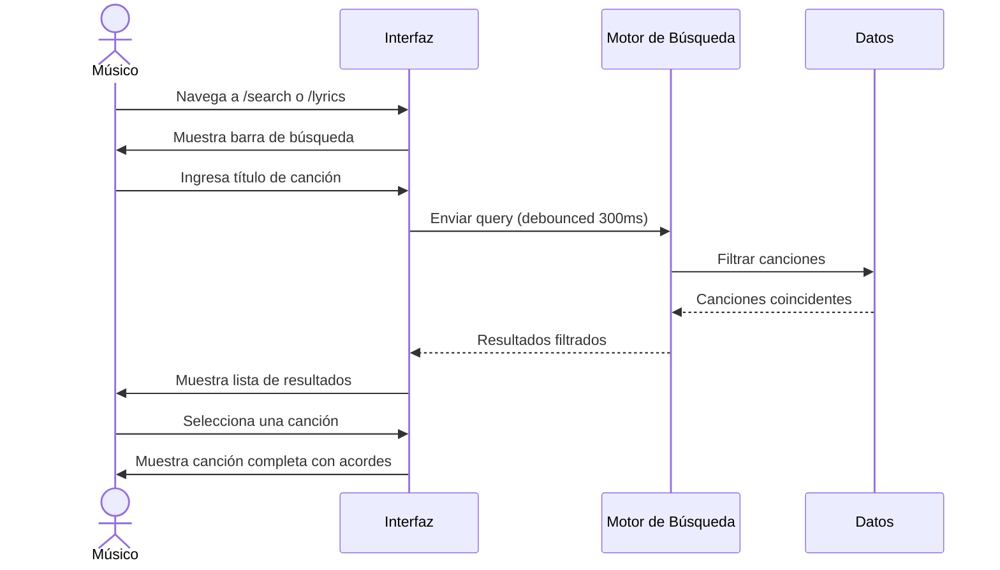

# UC-001: Buscar Canción

## Información del Caso de Uso

| Campo | Valor |
|-------|-------|
| **ID** | UC-001 |
| **Nombre** | Buscar Canción |
| **Actor Principal** | Músico Litúrgico |
| **Prioridad** | Alta |
| **Estado** | ✅ Implementado |

---

## 1. Descripción

El usuario desea encontrar una canción específica dentro del cancionero para visualizar su letra y acordes.

## 2. Flujos de Eventos

### 2.1 Flujo Principal (Happy Path)



### 2.2 Flujo con Filtros

1. El usuario accede a la página de búsqueda
2. El usuario hace clic en "Mostrar Filtros"
3. El usuario selecciona una o más categorías:
   - Parte de la misa (ej: "Comunión")
   - Tiempo litúrgico (ej: "Cuaresma")
   - Celebración especial (ej: "Bautismos")
4. El sistema filtra automáticamente las canciones
5. El usuario visualiza los resultados

### 2.3 Flujo Alternativo: Sin Resultados

1. El usuario realiza una búsqueda
2. El sistema no encuentra coincidencias
3. El sistema muestra mensaje: "No se encontraron canciones"
4. Se sugiere:
   - Revisar la ortografía
   - Ampliar los filtros
   - Agregar la canción manualmente

## 3. Criterios de Aceptación

### 3.1 Búsqueda por Título

```gherkin
Feature: Búsqueda de canciones

  Scenario: Búsqueda exitosa por título
    Given el usuario está en la página de búsqueda
    When el usuario escribe "Aleluya" en la barra de búsqueda
    Then el sistema muestra canciones que contengan "Aleluya"
    And los resultados aparecen en menos de 300ms

  Scenario: Búsqueda sin resultados
    Given el usuario está en la página de búsqueda
    When el usuario escribe "XYZABC123" en la barra de búsqueda
    Then el sistema muestra "No se encontraron canciones"

  Scenario: Búsqueda con menos de 3 caracteres
    Given el usuario está en la página de búsqueda
    When el usuario escribe "Al" en la barra de búsqueda
    Then el sistema no muestra resultados hasta completar 3 caracteres
```

### 3.2 Búsqueda con Filtros

```gherkin
Feature: Filtros de búsqueda

  Scenario: Filtrar por parte de la misa
    Given el usuario ha abierto los filtros
    When el usuario selecciona "Comunión"
    Then el sistema muestra solo canciones de la categoría "Comunión"

  Scenario: Filtrar por múltiples categorías
    Given el usuario ha abierto los filtros
    When el usuario selecciona "Comunión" y "Tiempo Ordinario"
    Then el sistema muestra canciones que pertenezcan a ambas categorías

  Scenario: Limpiar filtros
    Given el usuario tiene filtros activos
    When el usuario hace clic en "Limpiar"
    Then todos los filtros se deseleccionan
    And se muestran todas las canciones
```

## 4. Requisitos Especiales

### 4.1 Rendimiento
- Los resultados deben mostrarse en menos de 300ms después de la última tecla
- Implementar debounce de 300ms para evitar búsquedas excesivas
- Limitar resultados mostrados a 50 canciones máximo

### 4.2 Accesibilidad
- La barra de búsqueda debe ser navegable por teclado
- Los resultados deben tener roles ARIA apropiados
- Soporte para lectores de pantalla

### 4.3 Responsive
- En móvil: búsqueda full-width
- En desktop: búsqueda en panel lateral izquierdo

## 5. Mockups

### Desktop
```
┌─────────────────────────────────────────────────────────┐
│  🔍 Buscar por título                                    │
│  ┌─────────────────────────────────────────────────┐   │
│  │ Escribe el nombre de la canción...               │   │
│  └─────────────────────────────────────────────────┘   │
│  [Mostrar Filtros]  [Limpiar]                           │
├─────────────────────────────────────────────────────────┤
│  📊 Estadísticas           │  📋 Resultados               │
│  Total: 100 canciones      │  ┌─────────────────────┐   │
│  Resultados: 5             │  │ 🎵 Aleluya Pascual  │   │
│                            │  │ 🎵 Aleluya Navidad  │   │
│                            │  └─────────────────────┘   │
└─────────────────────────────────────────────────────────┘
```

---

*Caso de uso registrado por Eco Celestial Team*